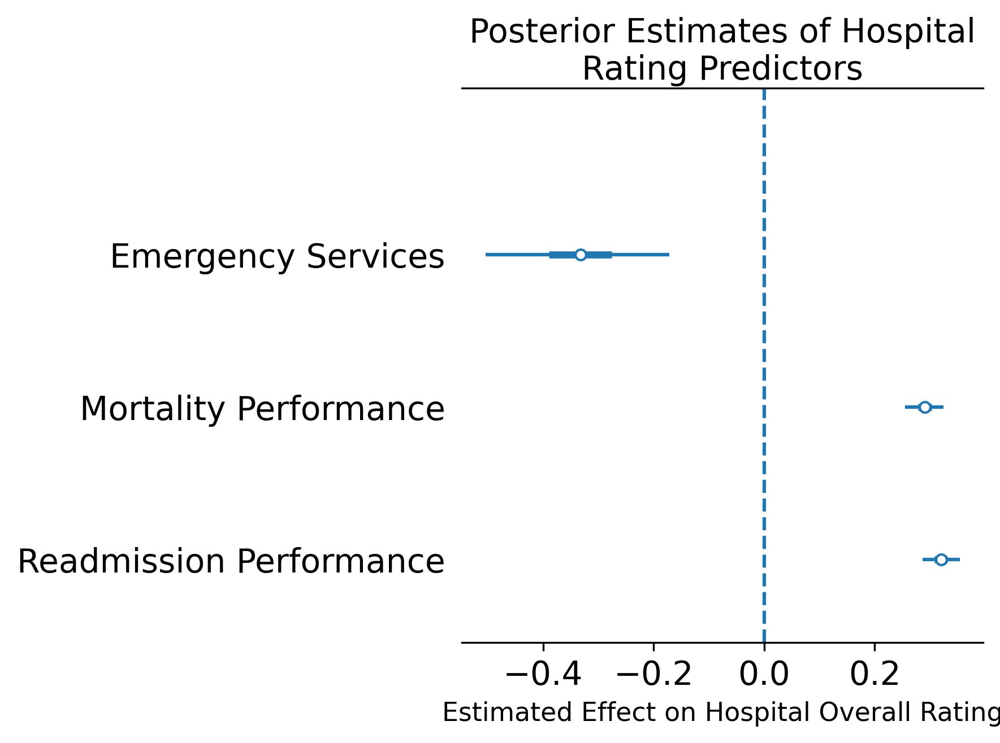

# Bayesian Hierarchical Analysis of CMS Hospital Ratings

**Angela Holm**  
Healthcare Analytics | Business Intelligence | Python | Bayesian Modeling

## Project Overview

This project examines patterns in hospital quality ratings using publicly available data from the Centers for Medicare & Medicaid Services (CMS). The analysis focuses on whether selected hospital characteristics and quality measures are associated with differences in overall hospital ratings.

Python was used to prepare and analyze the data, while PyMC was used to develop a Bayesian hierarchical model. The model examines hospital overall ratings in relation to emergency service availability, mortality performance, and readmission performance while accounting for differences among state and territory groups.

The project demonstrates an end-to-end healthcare analytics workflow that includes data preparation, feature engineering, statistical modeling, Bayesian inference, model diagnostics, visualization, and interpretation of hospital performance measures.

## Research Question

How are emergency service availability, mortality performance, and readmission performance associated with CMS hospital overall ratings after accounting for geographic variation among states and territories?

## Dataset

The original CMS dataset contained **5,432 hospitals and 38 variables**.

After preparing the data and removing observations with unavailable information required for the model, the final analytical dataset contained:

- **3,179 hospitals**
- **54 state and territory groups**
- **Outcome:** Hospital Overall Rating
- **Predictors:** Emergency Services, Mortality Performance, and Readmission Performance

Hospital overall ratings range from **1 to 5**.

## Tools and Technologies

- **Python** — primary programming language
- **Pandas** — data preparation and transformation
- **NumPy** — numerical operations
- **PyMC** — Bayesian hierarchical modeling and MCMC sampling
- **ArviZ** — posterior analysis, convergence diagnostics, and visualization
- **Matplotlib** — statistical visualization
- **Jupyter Notebook** — analysis and documentation environment

## Analytical Workflow

The analysis included:

1. Loading and reviewing the CMS hospital dataset
2. Cleaning unavailable and missing observations
3. Converting selected variables to appropriate numeric formats
4. Encoding emergency service availability
5. Creating state-level group identifiers
6. Standardizing mortality and readmission performance measures
7. Building a Bayesian hierarchical model
8. Performing Markov Chain Monte Carlo (MCMC) sampling
9. Evaluating posterior distributions and model diagnostics
10. Visualizing and interpreting model estimates

## Bayesian Hierarchical Model

The model estimates relationships between hospital-level characteristics and overall hospital ratings while allowing hospital ratings to vary across state and territory groups.

The model includes:

- An overall intercept
- Emergency service availability
- Standardized mortality performance
- Standardized readmission performance
- State-level random effects
- Residual variation

This hierarchical structure allows the analysis to estimate overall relationships across hospitals while accounting for geographic grouping.

## Key Findings

The posterior estimates identified several relationships within the model:

| Predictor | Posterior Estimate | Interpretation |
|---|---:|---|
| Emergency Services | -0.333 | Negative association with overall hospital rating |
| Mortality Performance | 0.291 | Positive association with overall hospital rating |
| Readmission Performance | 0.320 | Positive association with overall hospital rating |

Better mortality and readmission performance were associated with higher hospital overall ratings.

Emergency service availability showed a negative association with overall hospital rating after accounting for the other predictors and state-level variation. This relationship should be interpreted as an association rather than evidence that providing emergency services causes lower ratings.

The estimated state-level standard deviation was approximately **0.293**, indicating that some variation in hospital ratings remained associated with geographic grouping after accounting for the hospital-level predictors.

## Model Diagnostics

The MCMC sampling process produced strong diagnostic results:

- **Maximum R-hat:** 1.001
- **Minimum bulk effective sample size:** approximately 3,417
- **Minimum tail effective sample size:** approximately 4,742
- **Divergent transitions:** 0

These diagnostics indicate strong convergence and no major sampling problems in the fitted model.

## Visualization

A posterior coefficient plot is included in this repository to visualize the estimated direction, magnitude, and uncertainty of the three hospital-level predictors.

The 95% highest density intervals (HDIs) for all three predictors remain on one side of zero, showing that the posterior distributions consistently support the direction of these relationships within the model.

## Limitations

This analysis examines statistical associations and should not be interpreted as establishing causal relationships. Hospital performance may be influenced by additional factors not included in the model, including patient populations, case complexity, hospital size, available services, and other organizational or regional characteristics.

Hospital overall rating is also an ordered rating from 1 to 5. In this analysis, it is modeled as a numeric outcome using a normal likelihood. Future work could explore an ordinal modeling approach that more directly reflects the ordered structure of the rating scale.

Results are also specific to the hospitals and measures available in the dataset used for this analysis and may change as CMS hospital performance data and rating methodologies are updated.

## Skills Demonstrated

Healthcare Analytics • Python • Bayesian Statistics • Statistical Modeling • Data Cleaning • Feature Engineering • MCMC Sampling • Posterior Inference • Model Diagnostics • Data Visualization • Healthcare Quality Analysis

## Author

**Angela Holm**  
Healthcare Analytics | Business Intelligence
